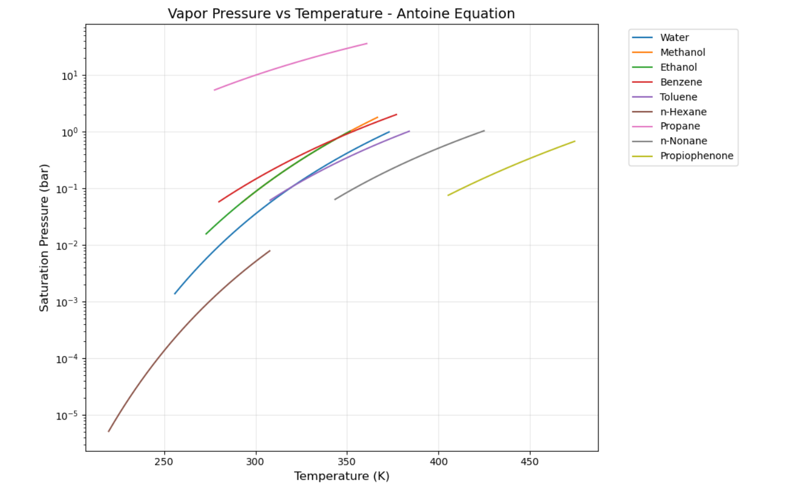

# Vapor Pressure Calculator — Antoine Equation

A Python tool that computes and visualizes the vapor pressure of pure chemical
compounds as a function of temperature, using the Antoine equation with
experimentally validated constants sourced from the NIST Chemistry WebBook.

## What it does

- Plots vapor pressure curves (Psat vs T) for 9 compounds on a single
  comparative figure and as individual plots
- Computes the normal boiling point of each compound at any user-specified
  pressure using numerical root-finding (Brent's method via scipy)
- Handles out-of-range cases gracefully when the specified pressure falls
  outside a compound's valid temperature range

## The Physics

The Antoine equation models the vapor pressure of a pure liquid as:

    log₁₀(Psat) = A - B / (C + T)

where A, B, C are compound-specific empirical constants and T is temperature
in Kelvin. Psat is returned in bar. Constants are valid only within each
compound's specified temperature range (T_min, T_max).

The boiling point finder solves Psat(T) = P_input by reformulating it as a
root-finding problem: find T such that Psat(T) - P_input = 0, solved using
Brent's method over the compound's valid temperature interval.

## Compounds Included

| Compound       | Formula   | CAS        |
|----------------|-----------|------------|
| Water          | H₂O       | 7732-18-5  |
| Methanol       | CH₃OH     | 67-56-1    |
| Ethanol        | C₂H₅OH    | 64-17-5    |
| Benzene        | C₆H₆      | 71-43-2    |
| Toluene        | C₇H₈      | 108-88-3   |
| n-Hexane       | C₆H₁₄     | 110-54-3   |
| Propane        | C₃H₈      | 74-98-6    |
| n-Nonane       | C₉H₂₀     | 111-84-2   |
| Propiophenone  | C₉H₁₀O    | 93-55-0    |

## Requirements

​```
numpy
matplotlib
scipy
​```

Install with:

​```
pip install numpy matplotlib scipy
​```
## Sample Output



## Author

YAHYA S'MOUNI — First-year engineering student, ENSCK, Ibn Tofail University